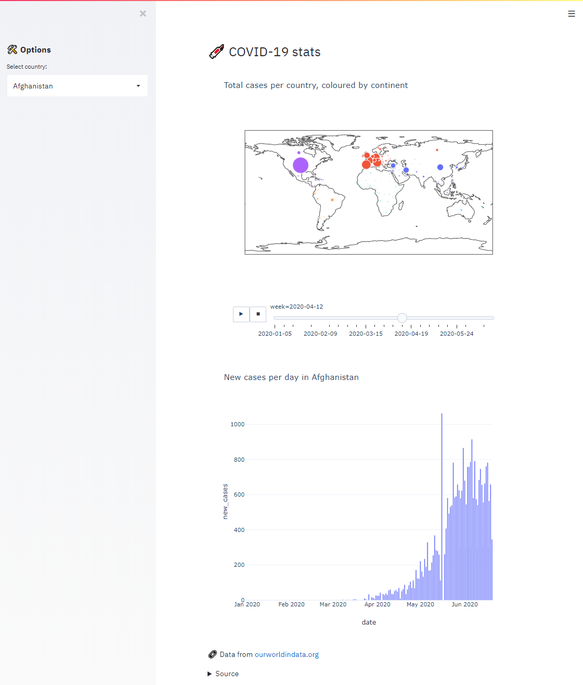
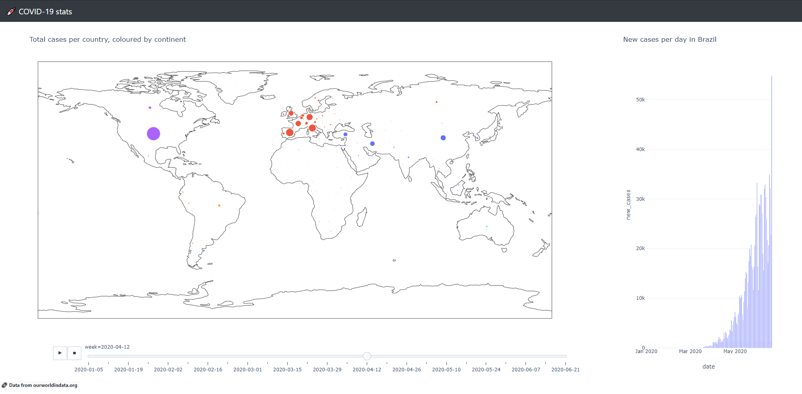
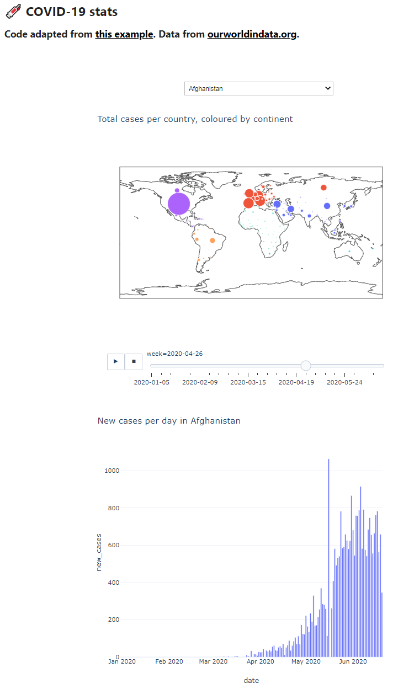

# Python web app comparison
Comparison of different python packages (streamlit, dash, voila) for generating web-based applications, using a basic example of data visualization with limited user interaction. 

## General requirements
Python 3.x set-up with `pandas` and `plotly` packages. The dataset used in the apps is found in assets/. 

## Demo
The example application takes a `*.csv` file with COVID-19 statistics per country and creates 2 figures:
1. The total number of cases as a function of time mapped per country.
2. The number of new cases per day for a selected country.

We turn this code into interactive apps using streamlit, dash and voila.

The basic code for loading, processing and plotting the data:
```python
import pandas as pd 
import plotly.express as px

df = pd.read_csv('https://raw.githubusercontent.com/bisdom1/apps/master/assets/owid-covid-data.csv', na_values='nan') 
df.date=pd.DatetimeIndex(df.date) # convert to date-time for bar chart plot
df.index=df.date
df['week'] = df.to_period('W').index.strftime("%Y-%m-%d") # convert to weekly data for time plotting
df = df[df['continent'].notna()] # remove world data (not a valid continent)
df = df[df['total_cases'].notna()] # remove incomplete rows
countries = df.location.unique() # get list of available countries

country = countries[0] # select the first country for plotting the bar chart

# Plot world map with total number of cases in time (show per week)
fig = px.scatter_geo(df, locations="iso_code", color="continent",
                     hover_name="location", size="total_cases",
                     animation_frame="week",
                     projection="equirectangular",
                     title='Total cases per country, coloured by continent',
                     size_max=50,
                     opacity=0.7,
                     template='plotly_white')
fig.show()

# Plot number of new cases per day for selected country
fig = px.bar(df[df.location==country], x="date", y="new_cases", title="New cases per day in " + country,template='plotly_white')
fig.show()
```

## Streamlit
[Streamlit](https://www.streamlit.io/) is an app framework optimized for data science and machine learning, with powerful caching. Adding interactive user elements typically only takes 1 line of code per element.

1. Install the `streamlit` package via `pip install streamlit` or `conda install streamlit` commands.
2. Download the `streamlit.py` example app from this repository.
3. To run the app in streamlit, open a python console (e.g. Anaconda prompt) and run the command `streamlit run streamlit.py`.
4. Open the app in your browser (Edge or Chrome) via http://localhost:8501.



## Plotly Dash
Compared to streamlit, [Plotly Dash](https://plotly.com/dash/) allows for building more complex user interfaces with more flexible and advanced customization for visualization, including for example interactive graphics with crosslinking between different plots. An example of this cross-linking is included in the demo app, where hovering over a country on the world map shows the number of cases per day for that country in the bar chart. 
The downside is that building apps requires more coding, but by using pre-built elements from [Dash Bootstrap Components](https://dash-bootstrap-components.opensource.faculty.ai/) the amount of code required can be quickly reduced.

1. Install the following 2 packages via `pip install` or `conda install`:
    1. `dash`
    2. `dash-bootstrap-components` (library of prebuilt dash components)
2. Download the `plotlydash.py` example app from this repository.
3. Launch the app by running the python file in your python environment (`python plotlydash.py`).
4. Open the app in your browser via http://localhost:8050.



## Jupyter Voila
Using [ipywidgets](https://ipywidgets.readthedocs.io/en/latest/), interactive user widgets can be added to jupyter notebooks. In combination with [Juypter Voila](https://github.com/voila-dashboards/voila), these notebooks can be converted to web applications with a completely customizable user interface. Voila is particularly useful for converting existing notebooks into apps, but coding is less intuitive compared to streamlit and dash.

1. Install `voila` and its dependencies using `pip install voila` or `conda install voila`. Note that it is also recommended to install a JupyterLab preview extension for Voila, see this [Github page](https://github.com/voila-dashboards/voila) for more detailed set-up instructions.
2. Download the `jupytervoila.ipynb` notebook example from this repository.
3. To run the app, there are 2 options:
    1. If you have the Jupyter voila extension, open the notebook in Jupyter. You can edit the notebook as a basic notebook. To run the notebook in voila, click on the __Voila__ button located in the top menu.
    2. Alternatively, launch the app via the command line interface: Open a python console (e.g. Anaconda prompt) and run the command `voila jupytervoila.ipynb`.
3. Open the app in your browser via http://localhost:8866/.

